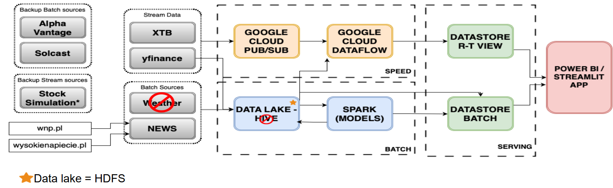
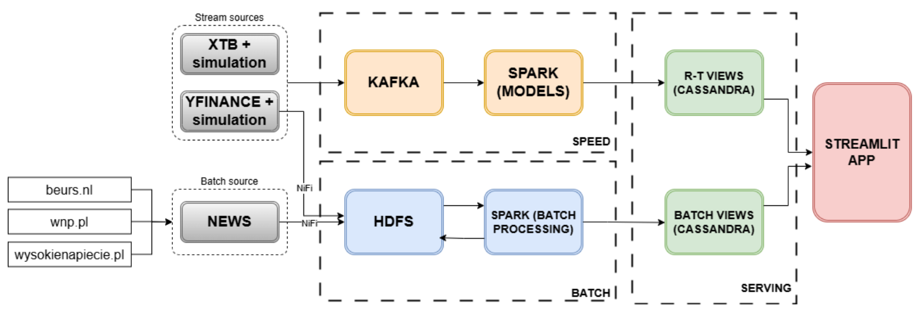
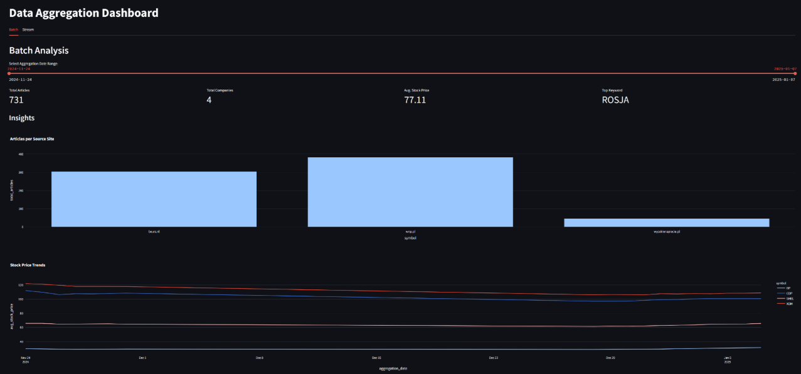
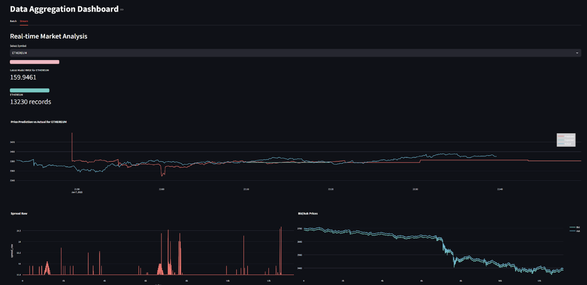

# Big Data Analytics Project

## Project Overview

This project implements a big data pipeline for collecting, processing, and analyzing financial and news data. It supports both batch and real-time (streaming) analytics, with dashboards for visualization.

---

## Architectural Evolution

Initially, the project was built on Google Cloud Platform (GCP) using:
- **Google Pub/Sub** for data brokerage
- **Google Cloud Datastore** for storage
- **Google Dataflow** for batch/stream processing

Due to a GCP policy violation, the project was **rebuilt to run entirely on a local virtual machine**.  
This resulted in several technology swaps:

| GCP Component         | Local VM Replacement |
|-----------------------|---------------------|
| Pub/Sub               | Apache Kafka        |
| Datastore             | Apache Cassandra    |

---

### Architecture Diagrams

<!-- Insert architecture diagrams here -->
- **Original GCP-based Architecture:**  
  

- **Final Local VM-based Architecture:**  
  

---

## How the Project Works

### Data Ingestion

#### Batch Layer
- **Scraping:** Python scripts scrape financial news and market data from various sources.
- **Batch Processing:** Scraped data is processed periodically and written to Hadoop HDFS as JSON files.
- **Aggregation:** Batch jobs (using Spark) aggregate and clean data, outputting daily summaries.

#### Streaming Layer
- **Simulated Data Streams:**  
  Due to limited API quotas, we simulate real-time financial data streams to populate our database. This allows us to test the full streaming and analytics pipeline without relying on third-party data providers for continuous data access.
- **Kafka:** Real-time (simulated) events are published and consumed via Apache Kafka topics.
- **Spark Structured Streaming:** Spark jobs read from Kafka, perform windowed aggregations, and output results to both HDFS and Cassandra.

### Data Storage

- **Raw Data Lake:** All incoming (raw and processed) data lands in Hadoop HDFS, partitioned by source and timestamp.
- **Aggregated Layer:** Cleaned and enriched data is written to Apache Cassandra in two keyspaces:
  - `gold_layer`: Batch aggregations (e.g., daily summaries)
  - `stream_predictions`: Real-time predictions/results (e.g., per-minute market forecasts)

### Orchestration

- **Apache NiFi:** Used to orchestrate data movement and transformation between ingestion, processing, and storage layers.
- **Shell Scripts:** Provided for launching all required components and restarting services on the local VM.

### Analytics and Machine Learning Module

- **Notebooks:** Jupyter notebooks (using PySpark and Pandas) for exploratory analysis, model development, and reporting.
- **ML for Price Prediction:**  
  The analytical module includes machine learning models for price prediction. These models are trained periodically on the latest data. After each new training session, the model's performance is evaluated against the previous version:
    - If the new model outperforms the old model on validation metrics, it is promoted to production (swapped in).
    - If not, the previous model remains active.
  This ensures only the best-performing models are used for real-time and batch predictions.
- **Streamlit App:** Interactive dashboard for visualizing:
  - Aggregated batch data (e.g., daily market summaries, news sentiment)
  - Live streaming predictions and analytics

---

### Database Schemas

#### Cassandra Keyspaces and Tables

- **gold_layer**
  - `aggregated_news`
  - `aggregated_yfinance`
  - `aggregated_keywords`
  - Typical fields: `aggregation_date`, `symbol`, `avg_price`, `avg_sentiment`, etc.

- **stream_predictions**
  - `model_predictions_10m`
  - Fields: `timestamp`, `symbol`, `predicted_price`, `input_data` (JSON), `event_time`, etc.

Data is written and retrieved using PySpark and direct Cassandra queries in the analytics and dashboard layers.

---

## Screenshots

<!-- Insert Streamlit app screenshots here -->

- **Streamlit Dashboard - Batch Analytics Views:**  
Count of atricles per source site (top), price trends (bottom)  
    

Volume traded per company (top) and top 10 keywords (bottom)
  %20and%20top%2010%20keywords%20(bottom).png.png)  

articles over time(top), average volatility per company(middle), stock price boxplot per company (bottom)  
  %2C%20average%20volatility%20per%20company(middle)%2C%20stock%20price%20boxplot%20per%20company%20(bottom).png.png)

Keyword treemap  
    

- **Streamlit Dashboard - Streaming Analytics View:**  
Example ETH stream data  
    

example SHELL stock price prediction vs real price  
    

example plots of market sentiment(top left) trading volume(top right) trading activity(bottom left) and volatility(bottom right)  
%20trading%20volume(top%20right)%20trading%20activity(bottom%20left)%20and%20volatility(bottom%20right).png)  

Correlation plot of ETH data  
  

Correlation plot of SHELL data

---

## Additional Notes

- All services, pipelines, and dashboards are orchestrated to work together on a single local VM.
- The project demonstrates the adaptability of big data analytics pipelines between cloud-native and on-premises (local VM) environments.
- The codebase contains legacy GCP code and documentation for reference, but the current version is fully VM-based.