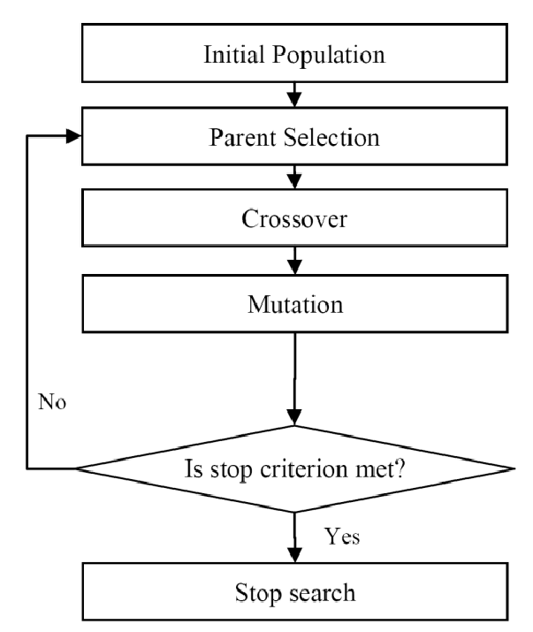
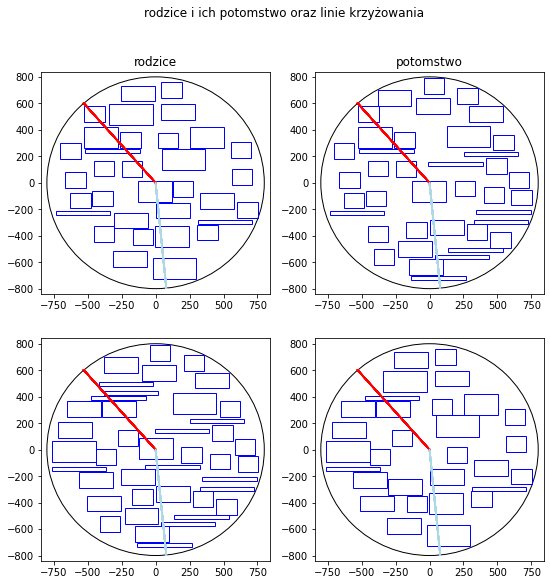
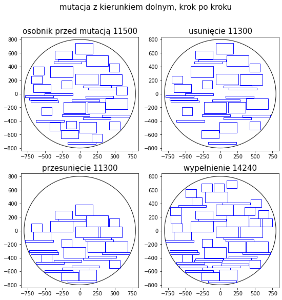

🧬 Evolutionary Algorithm for the Circular Cutting Stock Problem
This project explores the Cutting Stock Problem within a circular domain using Evolutionary Algorithms. The challenge: maximize the total value of rectangles placed inside a circle of fixed radius, without overlapping.
 
🧩 Problem Overview
Given:

A circle of known radius (the "cutting stock").

A set of rectangles, each defined by:

Width, height

A value

Goal:

Maximize the total value of non-overlapping rectangles placed inside the circle.

🧠 Evolutionary Representation
Individual (specimen): A list of rectangles, each defined by dimensions, position inside the circle, and value.

Population: A collection of such individuals.

🔁 Crossover
Angular Cut Crossover:

Two angles are randomly chosen (like slicing a pie).

Both parents are cut along these angles, producing two arc-shaped segments.

These segments are swapped between the parents to produce offspring.

Any overlapping or out-of-bound rectangles in the offspring are removed.

🔧 Mutation
After crossover, mutation is applied to improve or repair offspring near the "weld zone" (cut boundary).

Mutation Steps:s
Remove Low-Value Rectangles based on value-to-area ratio.

Select Direction, one of: left, right, up, down.

Shift all remaining rectangles in the chosen direction (simulating gravity).

Try to place rectangles falling in from outside the circle along the direction.

Rectangles are added if they fit without overlap.

This simulates gravity-driven optimization to pack the circle tighter and fill empty gaps after crossover.
