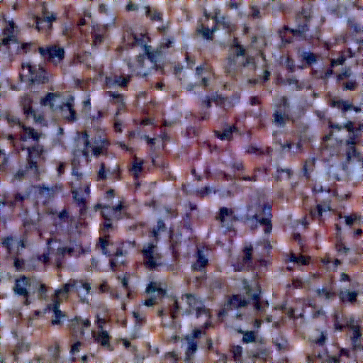
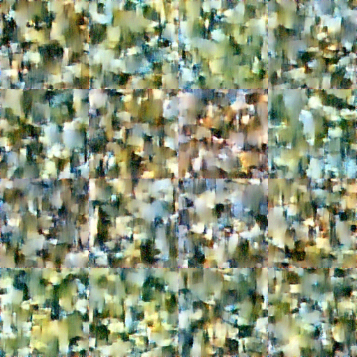
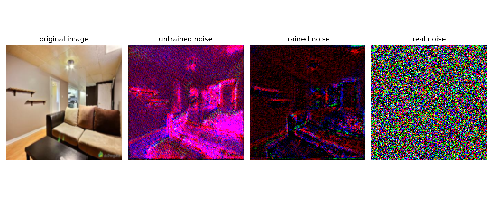
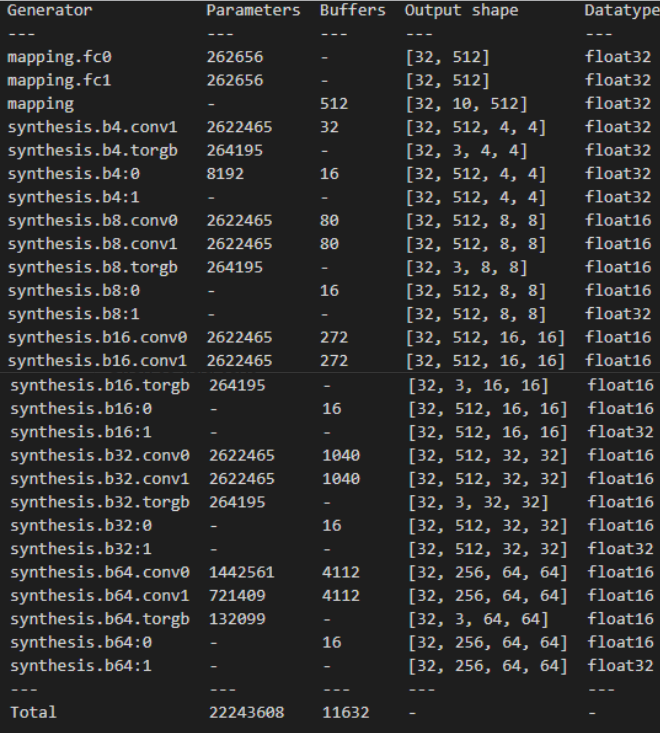
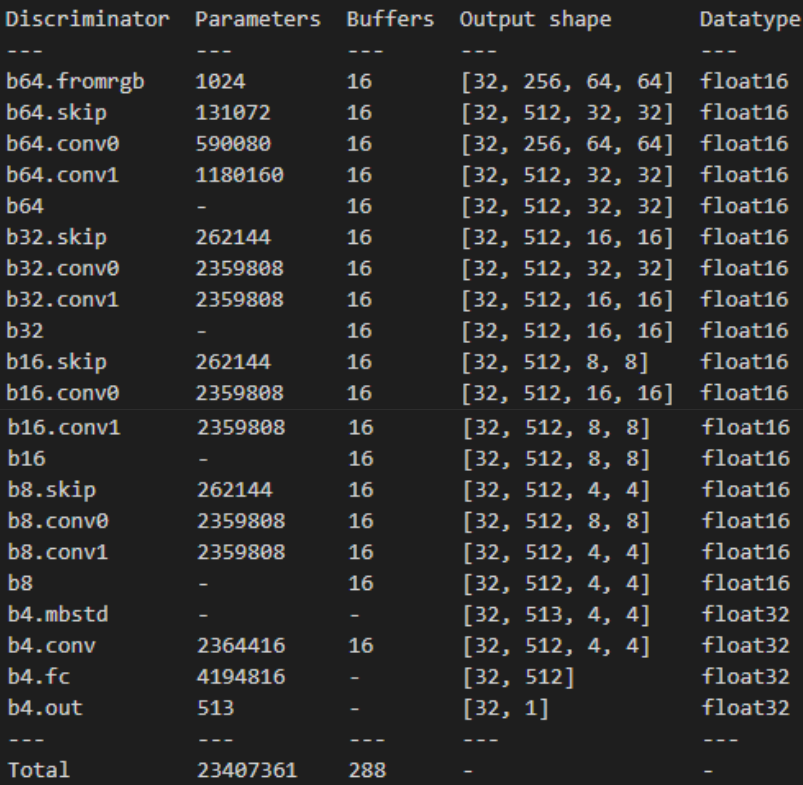
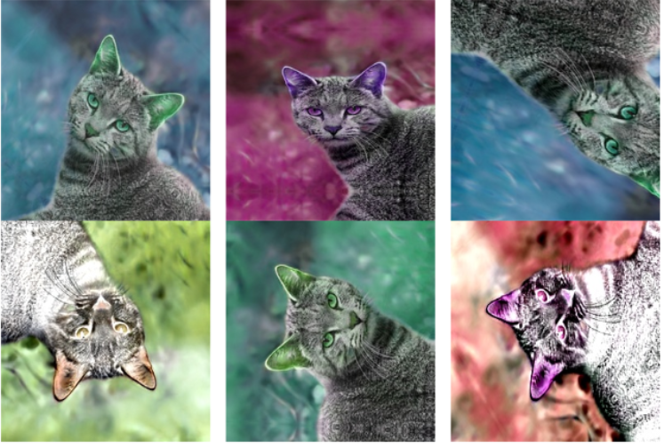
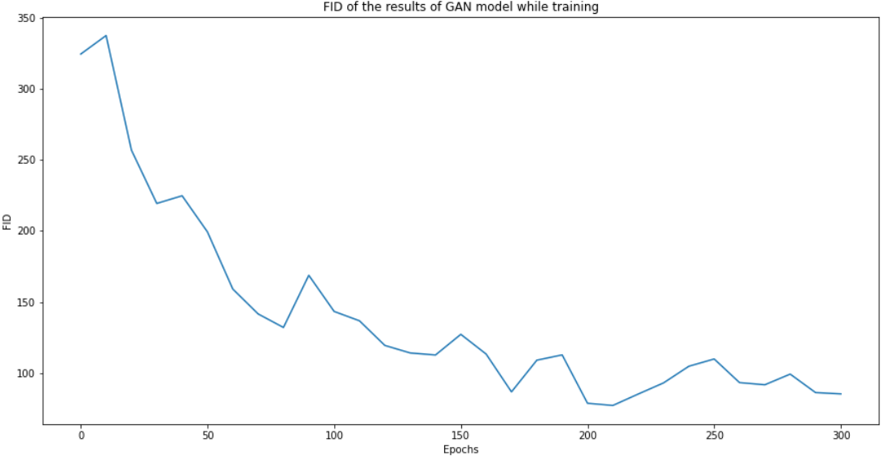
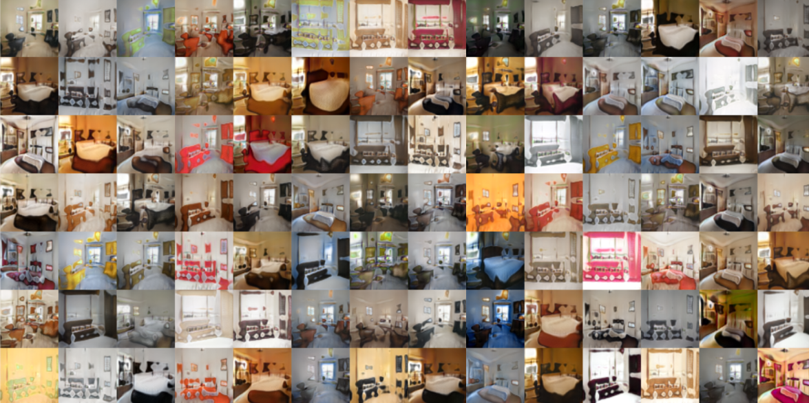
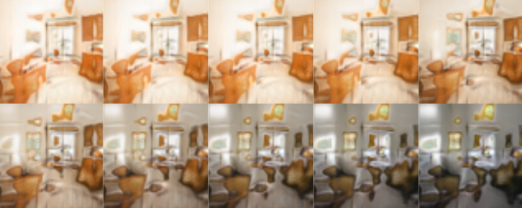

Abstract

This document acts as a report of the research and experimentation done for the project regarding image generation using difusion models. All codes are available at this link: link to github repository

<!-- 1 -->

# 1 Theoretical Introduction

## 1.1 Denoising Difusion Probabilistic Models

We follow the theoretical introduction of the model and derivation of loss function, as shown by Nichol & Dhariwal (2021):

Given a data distribution $x\_{0}$ $\sim q\left(x\_{0}\right)$ , we defne a forward noising process $q$  which produces latents $x\_{1}$  through $x\_{T}$  by adding Gaussian noise at time t with variance $\beta \_{t}\in$  $(0,1)$  as follows:

$q\left(x\_{1},\cdots ,x\_{T}\vert x\_{0}\right):=\pi \_{t=1}^{T}q\left(x\_{t}\vert x\_{t-1}\right)\tag{1}$

$q\left(x\_{t}\vert x\_{t-1}\right):=\mathcal {N}\left(\sqrt {1-\beta \_{t}}x\_{t-1},\beta \_{t}\mathbf {I}\right)\tag{2}$

Given sufciently large $T$  and a well behaved schedule of $\beta \_{t}$ , the latent $x\_{T}$ is nearly an isotropic Gaussian distribution.

This means, that this process takes us from the data distribution to a known distribution (Gaussian). This is provable for $T\rightarrow \infty ,$  but we have a fnite process, so we assume T is large enough, for this to work. Equation 2 means, that the distribution of the next sample ( $x\_{t}$ ) is going to be a normal distribution:

• centered at $\sqrt {1-\beta \_{t}}x\_{t-1}$  - centered at last sample, but downscaled by $\sqrt {1-\beta \_{t}}$ 

• with variance equal to $\beta \_{t}\mathbf {I}$  - here, the assumption is we use noise with a diagonal covariance matrix

  
Figure 1: example of the noising process from equation 2

If we could somehow defne a reverse process, such that given an image with some noise, the process would be able to tell what image that came from.

Thus, if we know the exact reverse distribution $q\left(x\_{t-1}\vert x\_{t}\right)$ , we can sample $x\_{T}\sim \mathcal {N}(0,\mathbf {I})$ and run the process in reverse to get a sample from $q\left(x\_{0}\right)$ . However, since $q\left(x\_{t-1}\vert x\_{t}\right)$ depends on the entire data distribution(...)

We cannot simply have the data distribution, because the problem would not have existed in the frst place. We would just be sampling from that distribution, therefore:

$(...)we$  approximate it using a neural network as follows:

$p\_{\theta }\left(x\_{t-1}\vert x\_{t}\right):=\mathcal {N}\left(μ\_{\theta }\left(x\_{t},t\right),Σ\_{\theta }\left(x\_{t},t\right)\right)\tag{3}$

<!-- 2 -->

As neural networks are universal function approximators, we could have a neural network, that takes as an input the noised version of the image, and gives as an output - a distribution over images, that could have produced this noised one. The network would produce a mean, and a covariance matrix given the image.

The network is supposed to tell, given a noisy image, what’s the gaussian distribution of images where that probably came from. The fact that its a Gaussian distribution is a strong assumption we can make perhaps only because of the ”very small steps” in the noising process.

The combination of $q$  and $p$  is a variational auto-encoder(Kingma Welling, 2013), and we can write the variational lower bound (VLB) as follows:

$L\_{vlb}:=\sum \_{i=0}^{T}L\_{i}\tag{4}$

$L\_{0}:=-\log p\_{\theta }\left(x\_{0}\vert x\_{1}\right)\tag{5}$

$L\_{t-1}:=D\_{KL}\left(q\left(x\_{t-1}\vert x\_{t},x\_{0}\right)\\ vertp\_{\theta }\left(x\_{t-1}\vert x\_{t}\right)\right)\tag{6}$

$L\_{T}:=D\_{KL}\left(q\left(x\_{T}\vert x\_{0}\right)\\ vertp\left(x\_{T}\right)\right)\tag{7}$

Equation 6 essentially means, that we want $q\left(x\_{t-1}\vert x\_{t},x\_{0}\right)$  (the distribution that we want to model) $\text {and}p\_{\theta }\left(x\_{t-1}\vert x\_{t}\right)$  (the reverse process that the neural network does) to be close to be close one an other ( $D\_{KL}$  - Kullback-Leiber divergence essentially measures that distance in terms of probability distributions).

Aside from $L\_{0}$ , each term of Equation $4$  is a KL divergence between two Gaussian distributions, and can thus be evaluated in closed form.

To evaluate $L\_{0}$  for images, we assume that each color component is divided into 256bins, and we compute the probability of $p\_{\theta }\left(x\_{0}\vert x\_{1}\right)$  landing in the correct bin (which is tractable using the CDF of the Gaussian distribution).

Also note that while $L\_{T}$  does not depend on $\theta$ , it will be close to zero if the forward noising process adequately destroys the data distribution so that $q\left(x\_{T}\vert x0\right)\approx \mathcal {N}(0,\mathbf {I})$ 

The question now is - how to calculate $q\left(x\_{t-1}\vert x\_{t},x\_{0}\right)$ 

As noted in (Ho et al., 2020), the noising process defned in Equation 2 allows us to sample an arbitrary step of the noised latents directly conditioned on the input $x\_{0}$  With $α\_{t}:=1-\beta \_{t}$ and $\bar {α}\_{t}:=\prod \_{s=0}^{t}α\_{s}$ , we can write the marginal distribution

$q\left(x\_{t}\vert x\_{0}\right)=\mathcal {N}\left(\sqrt {\bar {α}\_{t}}x\_{0},\left(1-\bar {α}\_{t}\right)\mathbf {I}\right)\tag{8}$

Using Bayes theorem, one can calculate the posterior $q\left(x\_{t-1}\vert x\_{t},x\_{0}\right)$  in terms $\text {of}\widetilde {\beta }\_{t}$  and $\widetilde {μ}\_{t}\left(x\_{t},x\_{0}\right)$  which are defned as follows:  e

$\widetilde {\beta }\_{t}:=\frac {1-\bar {α}\_{t-1}}{1-\bar {α}\_{t}}\beta \_{t}\tag{9}$

$\widetilde {μ}\_{t}\left(x\_{t},x\_{0}\right):=\frac {\sqrt {\bar {α}\_{t-1}}\beta \_{t}}{1-\bar {α}\_{t}}x\_{0}+\frac {\sqrt {α\_{t}}\left(1-\bar {α}\_{t-1}\right)}{1-\bar {α}\_{t}}x\_{t}\tag{10}$

$q\left(x\_{t-1}\vert x\_{t},x\_{0}\right)=\mathcal {N}\left(\widetilde {μ}\_{t}\left(x\_{t},x\_{0}\right),\widetilde {\beta }\_{t}\mathbf {I}\right)\tag{11}$

There are many diferent ways to parameterize µθ $\left(x\_{t},t\right)$ .The most obvious option is to predict µθ $40$ $\left(x\_{t},t\right)$ directly with a neural network. Alternatively, the network could predict $x\_{0}$  and this output could then be fed through equation 10 to produce $μ\_{\theta }\left(x\_{t},t\right)$ . The network could also predict the noise $E$  added to $x\_{0}$ , and this noise could be used to predict $x\_{0}$  via:

$x\_{0}=\frac {1}{\sqrt {α\_{t}}}\left(x\_{t}-\frac {\beta \_{t}}{\sqrt {1-\bar {α}\_{t}}}ε\right)\tag{12}$

<!-- 3 -->

## 1.2 GAN - General Adversarial Network

Generative Adversarial Networks (GANs for short) are a class of machine learning frameworks consisting of two neural networks, the Generator and the Discriminator, that compete against each other.

The Generator is designed to produce data samples similar to the real data by transforming a noise $\widetilde {x}$ while the Discriminator’s role is to classify data as real or fake. It vector z into a data point e processes an input data sample x orx and outputs a probability.

et al. (2014): eThe standard GAN loss function, known as the min-max loss function, was described by Goodfellow

$\mathbf {E}\_{x}[\log D(x)]+\mathbf {E}\_{z}[\log (1-D(G(z)))]\tag{13}$

The generator tries to minimize this function, while the discriminator tries to maximize it.

In practice, it saturates for the generator, meaning that the generator quite frequently stops training if it doesn’t catch up with the discriminator.

The Standard GAN loss function can further be categorized into two parts: Discrimi nator loss and Generator loss.

. Equations 14 and 15 show stochastic gradients for updating the discriminator and generator respectively.

$\left.\nabla \_{\theta \_{d}}\frac {1}{m}\sum \_{i=1}^{m}\left[\log D\left(\mathbf {x}^{(i)}\right)+\log \left(1-D\left(G\left(\mathbf {z}^{(i)}\right)\right)\right)\right]\tag{14}$

$\nabla \_{\theta \_{g}}\frac {1}{m}\sum \_{i=1}^{m}\log \left(1-D\left(G\left(\mathbf {z}^{(i)}\right)\right)\right)\tag{15}$

In equation 14 $\log (D(x))$  refers to the probability that the generator is rightly classifying the real image. Maximizing log(1 −D(G(z))) means maximizing the capability of the discriminator to recognize fake images correctly.

## 1.3 Mode collapse

Mode collapse happens when the generator focuses on producing a limited set of data patterns that deceive the discriminator. It becomes fxated on a few dominant modes in the training data and fails to capture the full diversity of the data distribution.

### 1.3.1 Mitigation strategies

• WGAN Wasserstein Generative Adversarial Network - utilizes Wasserstein distance instead of cross-entropy. WGANs provide a more stable and informative training signal, allowing for smoother learning and reduced mode collapse. The gradient of the Wasserstein distance en ables better convergence, making WGANs efective in handling mode collapse and generating more diverse and realistic samples.

• Unrolled GAN - usage of a generator loss function that incorporates not only the current discriminator’s classifcations, but also the outputs of future discriminator versions. So the generator can’t over-optimize for a single discriminator.

# 2 Experiments

## 2.1 Difusion

We tried using a DDPM model with U-net architecture, like most of the implementations seen in the literature. U-net’s strenghts for this task may be:

<!-- 4 -->

1. they provide representations of diferent granularity - useful for denoising

2. U-nets have decreases in layer sizes - This forces the encoding to discard some informa tion which should improve denoising properties. The noise cannot be encoded into lower dimensions.

We tried using huggingface’s difusion model from their tutorial. Unfortunately, due to compu tation time we could only make it go on for three epochs. In fgures 5 and 6 our resulting images after 1 and 3 epochs, due to the computational cost, even after reducing the dataset to 5% of the original (It took 6-7 hours per epoch + the time to generate images).

  
Figure 2: 4x4 matrix of images generated after  

  

Figure 3: 4x4 matrix of images generated after frst epochthree epochs

And in fgure 4 the noise predicted before training, and after the three epochs: We can notice,

  

Figure 4: noise predicted by the model along with real noise

the trained model’s noise got a lot darker (its values decreased two-fold).It started visually resembling noise a bit more, perhaps.

<!-- 5 -->

## 2.2 GAN

To experiment on GAN, we have used this repository. It provides an already implemented archi-tecture,with the training, evaluation, and data augmentation codes.

The architecture is comprised of the generator and discriminator model. Both of them mainly use convolutional layers. Also, they change the data dimension from 2d into 4d (one dimension is the batch size), in the case of generator and from 4d into 2d in case of discriminator.

  

Figure 5: Generator architecture

  

Figure 6: Discriminator architecture

The data augmentation part, is done by a pipeline, that flips, changes colors,changes the hue, tilts and does a lot of different image operations, to reduce the impact of overfitting. It was necessary to use the pipeline, to be able to train the network.

  

Figure 7: example of data augmentation

To train this network, we used the Google Colab environment, on a small subset of the data (about 1000 images from the whole dataset, but then those images were augmented with a pipeline).This allowed us to use stronger graphic cards to train the network. There were two types of epochs.The evaluation was done every 10 epochs and additionally to training it also computed the FID.The training ones, only trained the model.

| Epoch type  | elapsed time  |
| --- | --- |
| evaluation training  | 10 min 2 min  |

<!-- 6 -->

The Frechet Inception Distance, or FID for short, is a metric for evaluating the quality of generated images and specifcally developed to evaluate the performance of generative adversarial networks. It quantifes the realism and diversity of artifcially generated images. The lower, the better. Below in fgure 8, FID vs epoch curve, for our GAN model.

  

Figure 8: The FID value depending on the training epoch

After the 300 epochs, we have stopped the training. The fnal FID score achieved was equal to 74, from the initial value of around 300. Even though the fnal value is still much bigger than the perfect score of 0, the sample images below show that the results were acceptable. 9

  

Figure 9: example of generated images after 300 epochs

## 2.3 Interpolation of latent noise for diferent generated images

Because our difusion model did not achieve satisfactory results, we only present the GAN’s inter polation of the images’ latent representations.

<!-- 7 -->

### 2.3.1 Discussion

By interpolating between latent noise vectors, We are essentially probing the latent space of the model. This task provides insights into the model’s generative capabilities and the structure of its latent space. The smoothness and coherence of the generated images should reveal the model’s capacity to learn continuous transformations and generate realistic intermediate representations.

The transition, displayed in fgure 10 seems smooth, but perhaps not strong enough. This may be due to the similarity of the two bedrooms generated (and consequently, perhaps from the small amount of images used for training). The smoother the transition would be, the better the continuity in the model’s latent space.

Figure 10: example of the linear interpolation, between top left and bottom right images

# 3 Conclusions

We have tried to compare two diferent architectures, the DDPM and the GAN. However, it turned out that the DDPM is too complex in terms of training time and we were not able to achieve satisfactory results. Therefore, the requirements of the project were only fulfled by the GAN model. This model actually managed to learn to generate images resembling bedrooms. Also,the minimalization of the FID curve over the epochs shows that this model somewhat converged.We were also able to compute the linear interpolation of the latent spaces of this model.

<!-- 8 -->

# References

Goodfellow, I. J., Pouget-Abadie, J., Mirza, M., Xu, B., Warde-Farley, D., Ozair, S., Courville, A.& Bengio, Y. (2014), ‘Generative adversarial networks’.

Nichol, A. Q. & Dhariwal, P. (2021), Improved denoising difusion probabilistic models, in M. Meila & T. Zhang, eds, ‘Proceedings of the 38th International Conference on Machine Learning’, Vol.139 of Proceedings of Machine Learning Research, PMLR, pp. 8162–8171.

URL: https://proceedings.mlr.press/v139/nichol21a.html

<!-- 9 -->

